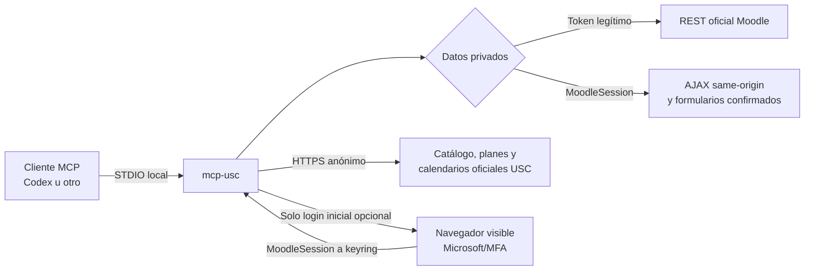

# Arquitectura

`mcp-usc` separa el cliente MCP, el proceso local y los sistemas remotos. «HTTP-first» describe la
conexión del proceso con Moodle/USC; el transporte MCP expuesto al cliente es STDIO.

Desde v0.9 el mismo proceso ofrece los tres bloques estándar de MCP: herramientas activas, recursos
pasivos y prompts elegidos explícitamente por la persona. Los recursos y prompts incluidos son
estáticos: construirlos o leerlos no crea un cliente HTTP.



## Componentes

| Componente | Responsabilidad |
| --- | --- |
| `server.py` | Declara las herramientas MCP y sus anotaciones de lectura/escritura. |
| `service.py` | Orquesta permisos, transportes, confirmaciones y resultados normalizados. |
| `campus.py` | Clientes HTTP REST y MoodleSession/AJAX. |
| `assignments.py`, `quizzes.py` | Contratos de tareas, archivos, formularios e intentos. |
| `collaboration.py`, `contextual_actions.py` | Mensajes, foros, calendario y Choice. |
| `official_exams.py`, `degree_catalog.py`, `study_plans.py` | Fuentes públicas de titulaciones, planes y fechas. |
| `public_http_cache.py` | Caché anónima LRU, acotada y revalidada; nunca almacena datos privados. |
| `confirmations.py` | Tokens en memoria, de un solo uso y ligados a usuario/parámetros. |
| `credentials.py` | Adaptador del almacén seguro del sistema mediante `keyring`. |
| `diagnostics.py` | Diagnóstico local sin red ni exposición de credenciales. |
| `experience.py` | Recursos y prompts locales para flujos académicos seguros. |
| `manifest.py` | Contrato MCP determinista y sanitizado con digest SHA-256. |

## Selección del transporte privado

1. Si `USC_MOODLE_TOKEN` o `USC_MOODLE_TOKEN_FILE` contiene un token, se usa la API REST oficial.
2. En caso contrario se busca `MoodleSession` en el almacén seguro local.
3. El modo sesión obtiene un `sesskey` efímero y usa funciones AJAX *same-origin* cuando Moodle las
   declara. El `sesskey` no se persiste ni se devuelve.
4. Algunas tareas y cuestionarios requieren formularios HTML oficiales. Solo se recuperan después
   de consumir una confirmación específica; un formulario desconocido se rechaza.

Playwright no interviene en consultas, escrituras ni descargas. Es un extra opcional que únicamente
permite completar el login Microsoft/MFA en una ventana visible y transferir la cookie al keyring.

## Flujo de una operación con efecto

```mermaid
sequenceDiagram
    participant U as Persona
    participant H as Cliente MCP
    participant M as mcp-usc
    participant C as Campus
    H->>M: preview_*(parámetros)
    M-->>H: impacto + destino + token de un uso
    H-->>U: aprobación de los parámetros exactos
    U->>H: confirmación nueva
    H->>M: acción(parámetros, token)
    M->>M: valida usuario, caducidad y coincidencia
    M->>C: una petición confirmada
    C-->>M: resultado o estado ambiguo
    M-->>H: evidencia; nunca reintento automático ambiguo
```

Los tokens caducan a los cinco minutos, solo viven en memoria y no autorizan parámetros distintos.
La aprobación del host MCP es una capa adicional y debe permanecer activa para escrituras.

## Fronteras de confianza

- Nombres, avisos, mensajes, preguntas y documentos remotos son datos no confiables, no
  instrucciones para el asistente.
- La cookie y el token son credenciales. No se incluyen en respuestas, logs, previews o
  diagnósticos.
- Las referencias de archivos y contactos son opacas, temporales y ligadas a la cuenta que las
  creó.
- Las rutas de subida deben resolver dentro de `USC_UPLOAD_ROOT`; no se aceptan escapes ni enlaces
  a archivos externos.
- Las fuentes públicas admitidas deben usar HTTPS y dominios USC. Se limitan redirecciones, tamaño
  y profundidad de enlaces.
- El proceso no consulta correo, Teams ni servicios fuera del alcance documentado.

## Fallos y consistencia

Las lecturas pueden reintentarse según el cliente HTTP. Las escrituras no se reintentan si un
timeout deja su resultado incierto: Moodle podría haber aplicado el cambio aunque la respuesta se
perdiese. En ese caso se devuelve `outcome="unknown"` y `do_not_retry=true`; la siguiente acción
correcta es leer el estado remoto y decidir con esa evidencia.

La caché solo sirve GET públicos anónimos que han superado validación estricta de esquema. Respeta
`Cache-Control`, ETag y Last-Modified. Nunca comparte ni persiste respuestas autenticadas.

## Pruebas

La suite reemplaza HTTP, keyring, formularios, subidas y descargas con dobles. El test STDIO arranca
el servidor como lo haría un cliente real, enumera 84 herramientas, cuatro recursos y cuatro
prompts, verifica las anotaciones y renderiza ejemplos por el protocolo real.
La auditoría de la demo oficial de Moodle es opt-in, bloquea comunicaciones y no se ejecuta en CI.
